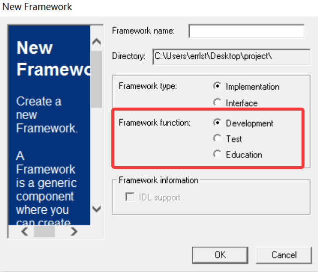
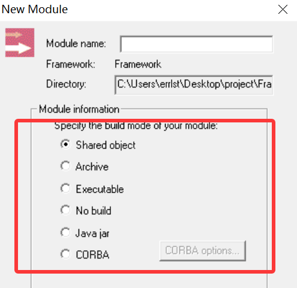
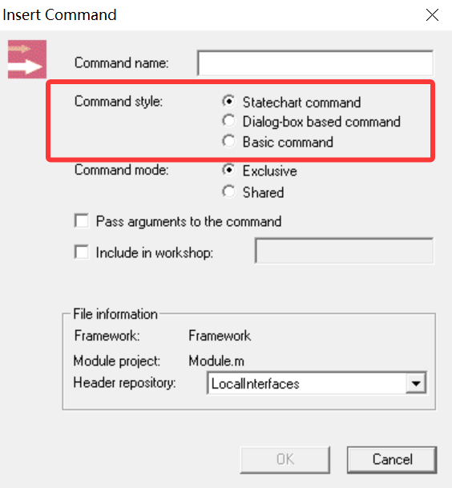
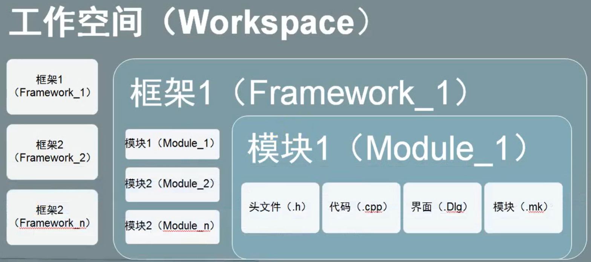
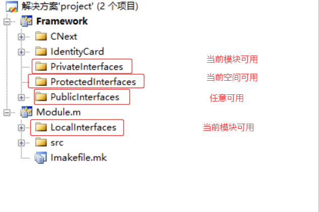
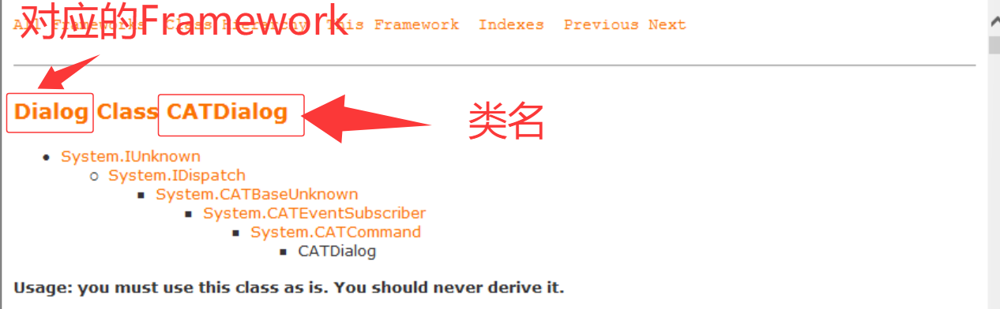
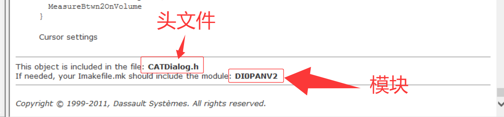
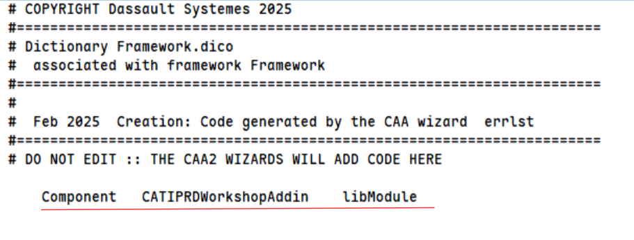
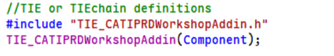

# 工程项目结构

## Framework & Module

有三种 Framework：

- Test Framework：测试框架。

- Education Framework：教学框架。

- Development Framework：开发框架。

有五种 Module：

- Shared object：生成 DLL，集成到 catia 中。

- Executable：生成 exe 文件，不需要打开 catia。

## Command

有三种 Command：

- Basic command：无界面无交互的命令。

- Dialog-box based command：有界面无交互的命令。

- Statechart command：有界面有交互的命令。

shared：command 可以被其它 command 调用。

## 文件结构

Framework

- PrivateInterfaces，头文件仅当前框架可用。

- ProtectedInterfaces：头文件仅当前空间可用。

- PubliccInterfaces：头文件任意地方可用。

Module

- LocalInterfaces：头文件仅当前模块可用。

## CAA Helper

## 依赖

在 Framework 的 `IdentityCard/IdentityCard.h` 文件中，添加对其他 Framework 的依赖。

在 Module 的 `Imakefile.mk` 文件中，添加对其他 Module 的依赖。

## Addin

要修改一个 component 的 addin 需要修改两个地方：

- framework.dico

    

- component.cpp

  

## 资源文件

# 调试

vs2008：工具 -> runtime environment variable -> 添加变量 CNEXTOUTPUT 设置为 console，此后通过 cnext 打开 catia 会附带一个终端窗口可以输出。
