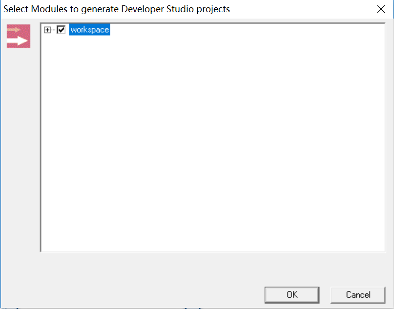

Catia CAA 提供的所有 Education Frame 在路径：`CATIA_INSTALLL_DIR\CAADoc`。

Visual Studio 2008 中加载 Frame 的流程如下：

1. 创建工作目录，并将 .edu 拷贝到目录中。

2. 打开 vs，文件 -> open caa workspace，选择目录。

3. 提示 select modules，选择 workspace 后确认。

    

4. locate prerequisites、mkmk、update ...。

