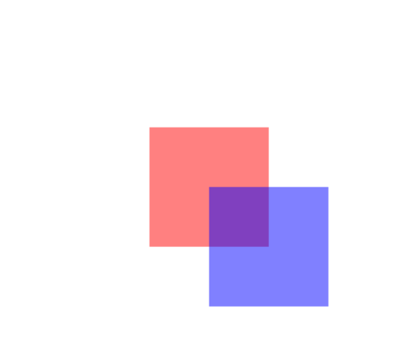

<link href="../../../../style.css" rel="stylesheet">

Item 类型是 QtQuick 中所有可视项的基本类型，虽然 Item 自身没有可视外观，但 Item 定义了可视项通用的所有属性。在 C++中对应的类型是 `QQuickItem`。

# 总览

| 属性(组)                      | 说明                                |
| ----------------------------- | ----------------------------------- |
| [anchors](#anchors)           | 通过其它项定位自己                  |
| antialiasing                  | 抗锯齿                              |
| children                      | 可视化子项                          |
| clip                          | 裁剪内容                            |
| data                          | 可视化子项和资源项，item 的默认属性 |
| enabled                       | 接受键盘鼠标事件                    |
| focus <br> focusPolicy        | 拥有焦点 <br> 聚焦方式              |
| height, width                 | 宽高                                |
| implicitHeight, implicitWidth | 首选宽高                            |
| [layer](#layer)               | 离屏渲染优化和特效                  |
| [opacity](#opacity)           | 透明度                              |
| palette                       | 调色板                              |
| parent                        | 可视父项                            |
| rotation                      | 旋转角度                            |
| scale                         | 缩放                                |
| smooth                        | 平滑采样                            |
| state                         | 状态字符串                          |
| states                        | 所有可能的状态列表                  |
| visible                       | 是否可见                            |
| visibleChildren               | 可见子项                            |
| x, y, z                       | 坐标和堆叠层级                      |

| 函数                                              | 说明                                          |
| ------------------------------------------------- | --------------------------------------------- |
| childAt(x, y)                                     | 返回该项坐标系中，点 (x,y) 对应的第一个可视项 |
| contains(point)                                   | 判断点是否在项的坐标范围内                    |
| forceActive(reason)                               | 强制聚焦                                      |
| [grabToImage(callback, targetsize)](#grabtoimage) | 抓取渲染结果到内存中                          |
| mapFrmGlobal(x, y) <br> mapToGlobal(x, y)         | 全局坐标系的点和项坐标系的点相互映射          |
| nextItemInFocusChain(forward)                     | 焦点链中相邻的项                              |

# anchors

| 属性                                                                                        | 类型                                                   | 说明                             |
| ------------------------------------------------------------------------------------------- | ------------------------------------------------------ | -------------------------------- |
| .top, ... <br> .topMargin, ... <br>.horizontalCenter, ... <br> .horizontalCenterOffset, ... | `AnchorLine` <br> `real` <br> `AnchorLine` <br> `real` | 根据其它锚定线定位               |
| .fill                                                                                       | `item`                                                 | 拥有和另一个 item 相同的几何形状 |
| .centerIn                                                                                   | `item`                                                 | 位于另一个 item 的中心           |

# layer

layer 属性组用于优化渲染性能、实现复杂特效、增强图形质量。

### layer.enable

控制可视项是否启用离屏渲染，默认为 `false`。

启用离屏渲染后，所有子项都会离屏渲染得到缓存的纹理，直到发生变化需要重新渲染。
后续的渲染操作直接复用这些纹理，而无需重新绘制。

只有启用离屏渲染时，其它 layer 属性才有效。

### layer.effect

为纹理添加特效，通常是 `ShaderEffect` 组件。

`Qt5Compat.GraphicalEffects` 模块中也预定义了一些常用特效，

### layer.smooth

启用后使用线性插值进行采用，否则使用最近邻采样。默认 `fales`。

# opacity

透明度选项同时会作用在子项，如果子项也设置了透明度，最终子项的透明度为 `parent_opacity * child_opacity`。

<div class="code_block">
<div>
代码：

```qml
Item {
  width: 400
  height: 400

  Rectangle {
    color: 'red'
    width: 100
    height: 100
    opacity: 0.5

    Rectangle {
      color: 'blue'
      width: 100
      height: 100
      x: 50
      y: 50
      opacity: 1
    }
  }
}
```

</div>
<div>
输出：



</div>
</div>

# grabToImage

`grabToImage(callback, targetsize)` 是一个异步函数，抓取完成后调用回调函数，通过 `targetSize` 设置目标图像大小。

<div class="code_block">
<div>
代码：

```qml
Item {
  width: 400
  height: 400

  Rectangle {
    id: rect
    width: 400
    height: 100
    anchors.centerIn: parent
    focus: true

    gradient: Gradient {
      GradientStop {
        position: 0
        color: 'steelblue'
      }
      GradientStop {
        position: 1
        color: 'black'
      }
    }
  }

  Keys.onSpacePressed: {
    rect.grabToImage(function (result) {
      console.log("save to out.png");
      result.saveToFile("out.png");
    });
  }
}
```

</div>

<div>
输出：


</div>
</div>
