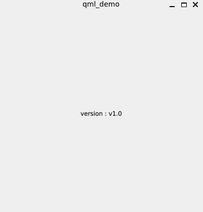

<link href="../../../../../style.css" rel="stylesheet">

有以下几种方式可以在 C++ 和 QML 之间交换数据：

- 使用 [setContextProperty](#setcontextproperty) 添加上下文属性，之后可以直接在 QML 使用。

- 使用 [qmlRegisterType](#qmlregistertype) 注册可实例化类，之后可在 QML 中使用该类。

- 使用 [qmlRegisterSingletonType](#qmlregistersingletontype) 注册单例类，之后可在 QML 中使用单例对象。

## setContextProperty

<div class="code_block" style="flex-direction:row">

<div>
<div>
main.cpp

```cpp
auto version = "v1.0";

auto main(int argc, char *argv[]) -> int {
  auto app = QGuiApplication{argc, argv};

  auto engine = QQmlApplicationEngine{};
  engine.rootContext()->setContextProperty("version", version);
  engine.load(QUrl::fromLocalFile(":/main.qml"));

  return QGuiApplication::exec();
}
```

</div>

<div>
main.qml

```qml
ApplicationWindow {
  id: root
  width: 400
  height: 400
  visible: true

  Text {
    anchors.centerIn: parent
    text: `version : ${version}`
  }
}
```

</div>
</div>

<div>
output



</div>

</div>

## qmlRegisterType

使用 `qmlRegisterType()` 向 QML 注册可实例化类，注册后的类可以在 QML 中使用。

<div class="code_block">

<div>
<div>
Message.h

```cpp
class Message : public QObject {
  Q_OBJECT
  Q_PROPERTY(QString message READ message WRITE setMessage)

public:
  auto message() const -> const QString & {
    qDebug() << "C++ get message" << message_;
    return message_;
  }

  auto setMessage(const QString &msg) -> void {
    qDebug() << "C++ set message " << msg;
    message_ = msg;
  }

private:
  QString message_;
};
```

</div>

<div>
输出

```shell
C++ set message  "q"
C++ get message "q"
qml: q
C++ set message  "qw"
C++ get message "qw"
qml: qw
```

</div>

</div>

<div>

<div>
main.cpp

```cpp
auto main(int argc, char *argv[]) -> int {
  auto app = QGuiApplication{argc, argv};

  qmlRegisterType<Message>("com.example", 1, 0, "Message");
  auto engine = QQmlApplicationEngine{QUrl::fromLocalFile(":/main.qml")};

  return QGuiApplication::exec();
}
```

</div>

<div>
main.qml

```qml
import QtQuick
import QtQuick.Controls
import com.example

ApplicationWindow {
  id: root
  width: 400
  height: 400
  visible: true

  Message {
    id: msg
  }

  TextEdit {
    anchors.fill: parent
    onTextChanged: () => {
      msg.message = text;
      console.log(msg.message);
    }
  }
}
```

</div>

</div>

</div>

## qmlRegisterSingletonType

使用 `qmlRegisterSingletonType()` 向 QML 中注册单例类，单例类在 C++ 中并非需要单例，在注册时需要传递一个对象，此后 QML 中对单例类的操作均在该对象上进行。

<div class="code_block">

<div>

<div>
Singleton.h

```cpp
class Singleton : public QObject {
  Q_OBJECT

public:
  static auto instance() -> Singleton * {
    static auto ins = Singleton{};
    return &ins;
  }

  Q_INVOKABLE void call(const QString &where) {
    qDebug() << "Singleton::call from" << where;
  }
};
```

</div>

<div>
main.cpp

```cpp
auto main(int argc, char *argv[]) -> int {
  auto app = QGuiApplication{argc, argv};

  qmlRegisterSingletonInstance("com.example", 1, 0, "Singleton", Singleton::instance());
  auto engine = QQmlApplicationEngine{QUrl::fromLocalFile(":/main.qml")};

  return QGuiApplication::exec();
}
```

</div>

</div>

<div>
main.qml

```qml
import QtQuick
import QtQuick.Controls
import com.example

ApplicationWindow {
  id: root
  width: 400
  height: 400
  visible: true

  Button {
    anchors.centerIn: parent
    onClicked: function () {
      Singleton.call("qml");
    }
  }
}
```

</div>

</div>
