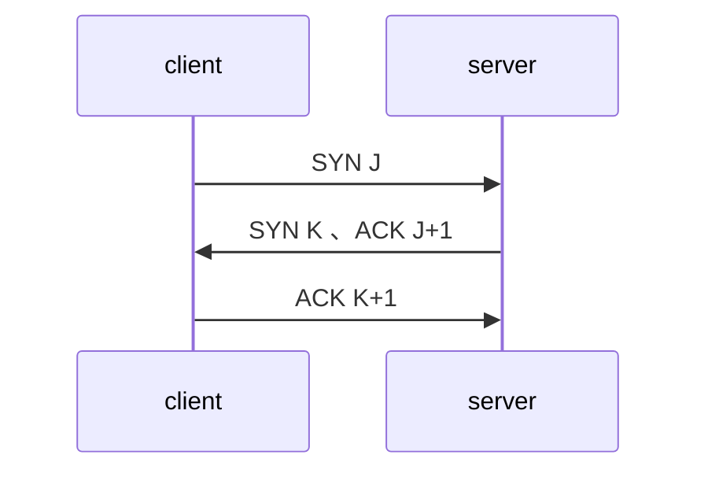
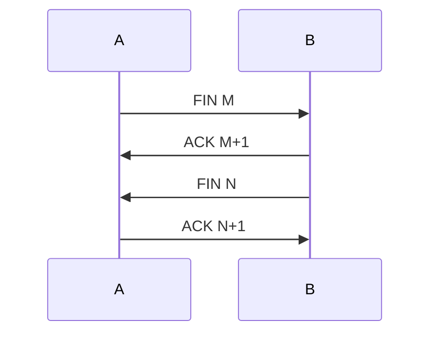

#### User Datagram Protocol
udp是简单的面向数据包的通讯协议。

###### 通讯
应用进程向udp套接字写入消息后，该消息被封装为一个udp数据报，而后被封装为一个IP数据报，发送到目的地。

###### 可靠性
udp缺乏可靠性，其不保证数据报一定会到达目的地、多个数据报之间被接受的先后顺序、一个数据报只会被接受一次等特性。

###### 报文
每个udp报文都包含整个报文的长度，整个报文的最大长度为65535字节。

#### Transmission Control Protocol
tcp是面向连接的、可靠的、基于字节流的通讯协议。

###### 通讯
tcp提供客户端与服务端之间的连接，连接成功后，进行数据交换，最后再断开连接。

###### 可靠性
tcp协议为每个字节关联一个序列号，对发送的数据进行排序，因此通过tcp传输的数据保证其发送的先后顺序和接受的先后顺序一致，且每个数据只会被接受一次。

###### 握手
建立tcp连接时，会进行以下操作（三次握手）：
1. 服务端调用 `socket()`、`bind()` 和 `listen()`，被动打开。
2. 客户端调用 `connect()` 发起主动打开。发送SYN包，通知服务端连接建立后发送数据的初始序列号。
3. 服务端确认客户端发送的SYN包，并发送ACK确认以及自己的初始序列号。
4. 客户端确认服务端发送的SYN包。

###### 挥手
断开tcp连接时，会进行以下操作（四次挥手）：
1. A端进程调用 `close()`，进行主动关闭。发送FIN包。
2. B接收到FIN后进行被动关闭，发送ACK确认关闭。
3. 一段时间后，B端发送FIN包。
4. A端发送ACK确认关闭。

###### TCP状态
* CLOSED：初始状态。
* LISTEN：服务端处于监听状态。
* SYN_RCVD：tcp握手时，服务端接受SYN报文后的中间状态，持续时间很短。
* SYN_SEND，tcp握手时，客户端发送SYN报文后的中间状态，持续时间很短。
* ESTABLISHED：连接已经建立。
* FIN_WAIT_1：主动关闭连接，发送FIN报文后，持续时间很短。
* FIN_WAIT_2：收到ACK回应后，此时对端还未关闭连接。
* TIME_WAIT：接收到FIN报文，并发送ACK报文后，等待2MSL超时后回到CLOSED。(msl表示任何ip数据报可在网络中存活的最大时间)
* CLOSE_WAIT：收到FIN报文。
* LAST_ACK：发送FIN报文，并等待ACK。
* CLOSING：两端几乎同时接收到FIN报文。即A发送FIN后，并未收到B的ACK，而是收到B的FIN。

