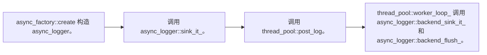

`registry` 维护了一个全局线程池，通过 async_factory 构造的 `async_logger` 通过该线程池进行异步日志记录。

异步日志记录的流程如下：



```cpp
auto main() -> int {
  /* 手动初始化 global thread pool */
  spdlog::init_thread_pool(1024, 4);

  /* 必须指定一个初始化的 sink */
  auto async_logger = spdlog::async_factory::create<spdlog::sinks::stdout_color_sink_mt>("async_logger");

  spdlog::set_level(spdlog::level::info);
  for (auto i = 0; i < 4; ++i) {
    async_logger->info("{}", i);
  }
  return 0;
}
```

```shell
[2025-03-05 14:55:21.107] [async_logger] [info] 0
[2025-03-05 14:55:21.107] [async_logger] [info] 1
[2025-03-05 14:55:21.107] [async_logger] [info] 3
[2025-03-05 14:55:21.107] [async_logger] [info] 2
```

## async_logger

```cpp
class async_logger final : public std::enable_shared_from_this<async_logger>, public logger;
```

### factory

通常并不直接使用 async_logger 的构造函数构造对象，而是使用 `async_factory_impl` 构造工厂。

```cpp
template <async_overflow_policy OverflowPolicy = async_overflow_policy::block>
struct async_factory_impl {

  template <typename Sink, typename... SinkArgs>
    static std::shared_ptr<async_logger> create(std::string logger_name, SinkArgs &&...args);
};

using async_factory = async_factory_impl<async_overflow_policy::block>;
using async_factory_nonblock = async_factory_impl<async_overflow_policy::overrun_oldest>;
```

- async_overflow_policy，线程池的日志消息队列满了之后的处理方式。

  ```cpp
  enum class async_overflow_policy {
    block,          // 阻塞直到消息可以插入队列
    overrun_oldest, // 删除队列头部消息
    discard_new     // 删除当前消息
  };
  ```
