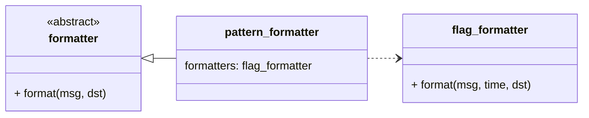

`formatter`，负责将 log_msg 转换为字符串。

`pattern_formatter`，spdlog 内置的一种 formatter，可以将 `%((-=)(number))(!)(flag)` 格式的 flag 转换为对应信息。

`flag_formatter`，单个 flag 的转换方式。

## log_msg

`log_msg` 是存放一条日志的载体。

```cpp
struct log_msg {
    string_view_t logger_name;
    level::level_enum level{level::off};
    log_clock::time_point time;
    size_t thread_id{0};

    mutable size_t color_range_start{0};
    mutable size_t color_range_end{0};

    source_loc source;
    string_view_t payload;  // 日志的原始字符串内容
};
```

<div style="display:flex;gap:10px;">

```cpp
namespace spdlog {
struct my_formatter final : public formatter {
  ~my_formatter() = default;
  void format(const details::log_msg &msg, memory_buf_t &dest) {
    std::println("payload: {}", msg.payload);
  }
  std::unique_ptr<formatter> clone() const { return std::make_unique<my_formatter>(); }
};
} // namespace spdlog

auto main() -> int {
  spdlog::default_logger()->set_formatter(std::make_unique<spdlog::my_formatter>());
  spdlog::info("hello world");
  return 0;
}
```

```shell
payload: ['h', 'e', 'l', 'l', 'o', ' ', 'w', 'o', 'r', 'l', 'd']
```

</div>
