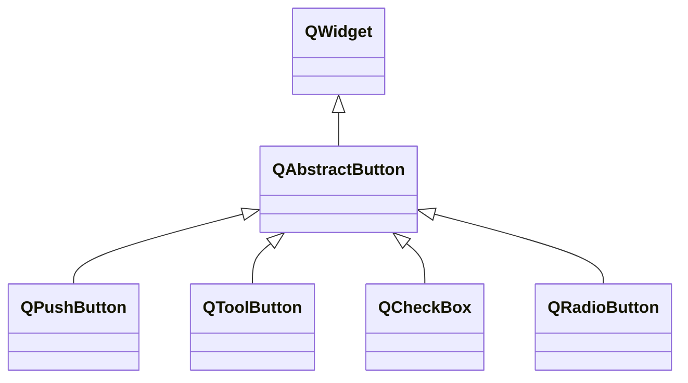

---

#### QAbstractButton

###### 常用属性

| 属性               | 类型           | 说明                                                         |
| ------------------ | -------------- | ------------------------------------------------------------ |
| autoExclusive      | `bool`         | 按钮是否具有自动排他性。                                     |
| autoRepeat         | `bool`         | 按钮按下后，是否会间隔重复送`pressed()`、`release()`和`clicked()`信号。 |
| autoRepeatDelay    | `int`          | 重复发送信号前的初始延迟，单位是毫秒。                       |
| autoRepeatInterval | `int`          | 重复发送信号的间隔，单位是毫秒。                             |
| checkable          | `bool`         | 按钮是否可以处于选中状态。                                   |
| checked            | `bool`         | 按钮是否处于选中状态。                                       |
| down               | `bool`         | 按钮是否被按下。                                             |
| icon               | `QIcon`        | 按钮显示的图标。                                             |
| shotcut            | `QKeySequence` | 按钮对应的快捷键。                                           |
| text               | `QString`      | 按钮显示的文字。                                             |

###### 常用信号

| 信号原型                             | 说明                       |
| ------------------------------------ | -------------------------- |
| `void clicked(bool checked = false)` | 按钮激活时触发。           |
| `void pressed()`                     | 按钮按下时触发。           |
| `void released()`                    | 按钮释放时触发。           |
| `void toggled(bool checked)`         | 按钮的选中状态改变时触发。 |

---

#### QPushButton

###### 常用属性

| 属性 | 类型   | 说明             |
| ---- | ------ | ---------------- |
| flat | `bool` | 按钮是否扁平化。 |

###### 常用函数

| 函数原型                    | 说明                 |
| --------------------------- | -------------------- |
| `void setMenu(QMenu* menu)` | 设置按钮关联的菜单。 |

---

#### QToolButton

`QToolButton`默认只显示图标，而无文本标签。其通常和`QToolBar`一起使用。

###### 常用属性

| 属性            | 类型                               | 说明                                                         |
| --------------- | ---------------------------------- | ------------------------------------------------------------ |
| arrowType       | `Qt::ArrowType`                    | 按钮上是否显示箭头，而非图标。默认为`Qt::NoArrow`。          |
| popupMode       | `QToolButton::ToolButtonPopupMode` | 点击按钮后菜单显示的方式，默认为`QToolButton::DelayedPopup`，即长按一段时间后显示菜单。 |
| toolButtonStyle | `QToolButton::toolButtonStyle`     | 按钮样式，默认为`Qt::ToolButtonIconOnly`，即只显示图标。     |

---

#### QCheckBox

`QCheckBox`是默认非自动排他性的可选中按钮。

与之对立的是`QRadioButton`。

###### 常用属性

| 属性     | 类型   | 说明                     |
| -------- | ------ | ------------------------ |
| tristate | `bool` | 按钮是否有三种选中状态。 |

###### 常用信号

| 信号原型                       | 说明                     |
| ------------------------------ | ------------------------ |
| `void stateChanged(int state)` | 按钮状态发生变化时触发。 |

