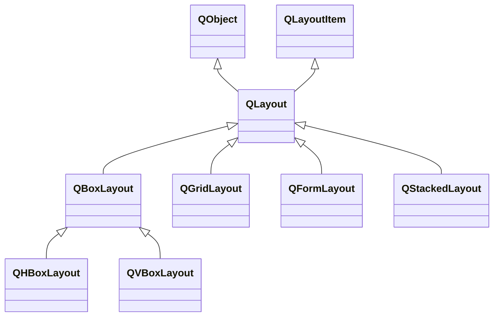

---

#### QLayout

Qt布局可大致分为水平、垂直、栅格和表单四种方式。

###### 常用属性

| 属性           | 类型                      | 说明                       |
| -------------- | ------------------------- | -------------------------- |
| sizeConstraint | `QLayout::SizeConstraint` | 布局中控件大小的调整策略。 |
| spacing        | `int`                     | 布局中控件间的间距。       |

###### 常用函数

| 函数原型                                                     | 说明                     |
| ------------------------------------------------------------ | ------------------------ |
| `void setEnable(bool enable)`                                | 设置是启用布局。         |
| `void addWidget(QWidget* widget)`                            | 添加控件。               |
| `void setContentsMargins(int left, int top, int right, int bottom)` | 设置布局内容周围的边距。 |