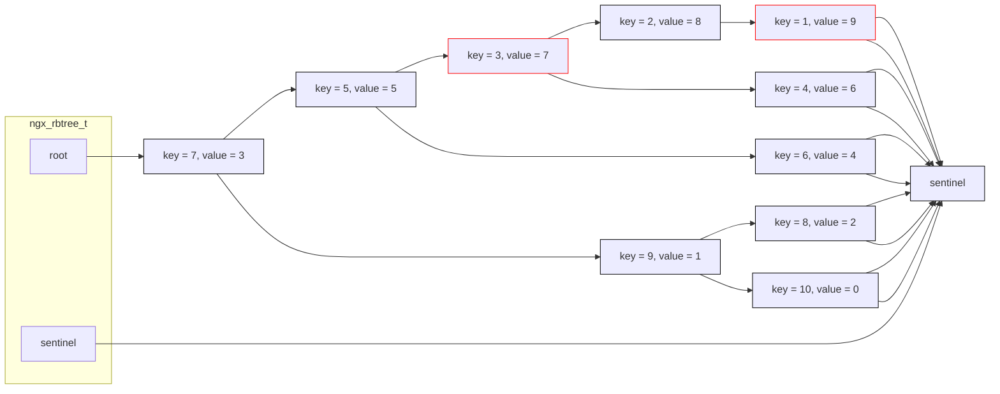

nginx 的红黑树也是侵入式的。

和通常的红黑树不同，nginx 实现的红黑树，所有数据节点都是非叶子节点，使用 `sentinel` 表示所有的叶子节点。

```cpp
// 红黑树节点
struct ngx_rbtree_node_t {
    ngx_uint_t key;
    ngx_rbtree_node_t *left;
    ngx_rbtree_node_t *right;
    ngx_rbtree_node_t *parent;
    u_char color;
    u_char data;
};

// 插入函数
using ngx_rbtree_insert_pt = void(*)(ngx_rbtree_node_t* root, ngx_rbtree_node_t* node, ngx_rbtree_node_t* sentinel);

// 红黑树
struct ngx_rbtree_t {
    ngx_rbtree_node_t *root;
    ngx_rbtree_node_t *sentinel;
    ngx_rbtree_insert_pt insert;
};
```

- `key`，通过 `key` 决定节点的大小，进行排序。

- `data`，简单数据存储。

## 初始化

- `ngx_rbtree_init(tree, sentinel, i)`，初始化树。

  - `sentinel`，哨兵节点，不能是 null。

  - `i`，插入函数，负责将新节点插入到红黑树中，三个参数分别是树的根节点、插入的节点和哨兵。

    > nginx 提供了默认的插入函数 `ngx_rbtree_insert_value` 和 `ngx_rbtree_insert_timer_value`。
    >
    > nginx 中的定时器通过 `ngx_rbtree_insert_timer_value` 插入，比较时是否考虑了 `key` 的溢出是两个默认插入函数的唯一区别。

## 添加节点

- `ngx_rbtree_insert(tree, node)`，插入节点。

## 删除节点

- `ngx_rbtree_delete(tree, node)`，删除节点。

## 示例

```c
typedef struct {
    ngx_rbtree_node_t node;
    ngx_int_t value;
} my_rbtree_node_t;

void iter_rbtree(ngx_rbtree_node_t *node, ngx_rbtree_node_t *sentinel, int depth) {
    if (node == sentinel) {
        return;
    }
    for (int i = 0; i < depth; ++i) {
        printf("\t");
    }
    printf("key = %ld, value = %ld\n", node->key, ((my_rbtree_node_t *)node)->value);
    iter_rbtree(node->left, sentinel, depth + 1);
    iter_rbtree(node->right, sentinel, depth + 1);
}

void test_rbtree(ngx_log_t *log) {
    ngx_pool_t *pool = ngx_create_pool(1024, log);
    ngx_rbtree_t tree;
    ngx_rbtree_node_t sentinel;
    ngx_rbtree_init(&tree, &sentinel, ngx_rbtree_insert_value);

    for (ngx_int_t i = 0; i < 10; ++i) {
        my_rbtree_node_t *node = ngx_palloc(pool, sizeof(my_rbtree_node_t));
        node->value = i;
        node->node.key = 10 - i;
        ngx_rbtree_insert(&tree, &node->node);
    }

    iter_rbtree(tree.root, tree.sentinel, 0);
}
```

```text
key = 7, value = 3, color = black
        key = 5, value = 5, color = black
                key = 3, value = 7, color = red
                        key = 2, value = 8, color = black
                                key = 1, value = 9, color = red
                        key = 4, value = 6, color = black
                key = 6, value = 4, color = black
        key = 9, value = 1, color = black
                key = 8, value = 2, color = black
                key = 10, value = 0, color = black
```

上述示例生成的红黑树结构如下：


