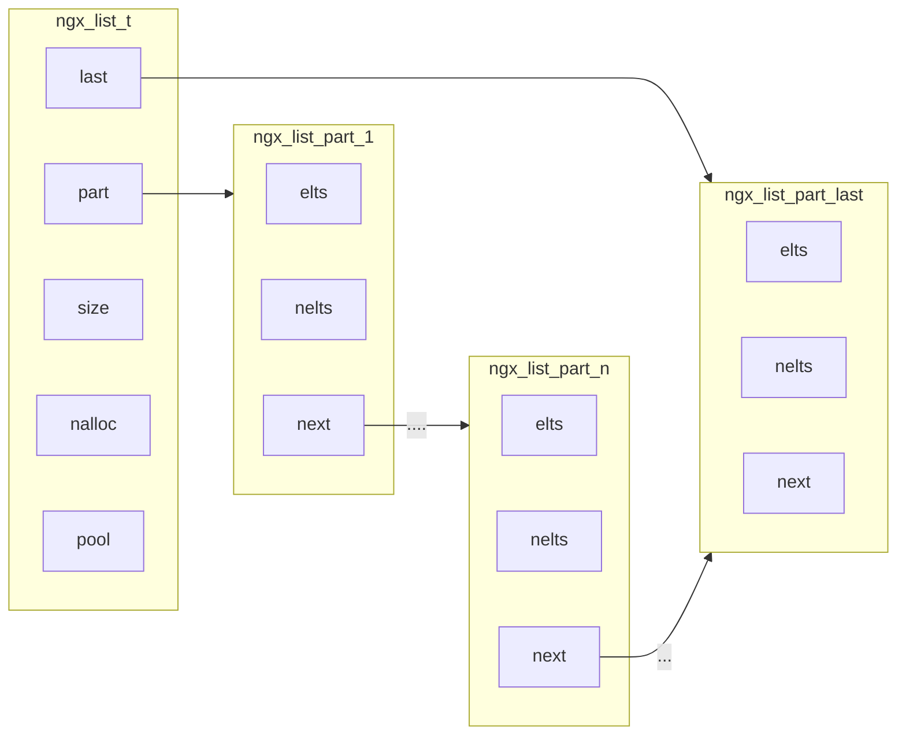

# List

```c
typedef struct ngx_list_part_s ngx_list_part_t;

struct ngx_list_part_s {
    void *elts;
    ngx_uint_t nelts;
    ngx_list_part_t *next;
};

typedef struct {
    ngx_list_part_t *last;
    ngx_list_part_t part;
    size_t size;
    ngx_uint_t nalloc;
    ngx_pool_t *pool;
} ngx_list_t;
```

`ngx_list_t` 将内存组织成块（nginx 中称为 part），然后将这些块通过链表串起来。

- `elts`，块起始地址。

- `nelts`，块有效元素数量。

- `part`，链表头节点。

- `tail`，链表尾节点。

- `size`，块中每个元素大小。

- `nalloc`，块中元素数量。



## 创建初始化

- `ngx_list_create(pool, n, size)`，创建队列，并初始化。

  - `n`，每个 part 元素的数量。

  - `size`，每个 part 元素的大小。

- `ngx_list_init(list, pool, n, size)`，初始化。

## 插入元素

- `ngx_list_push(list)`，插入一个元素并返回其地址。

```c
void iter_list(ngx_list_t *list) {
    printf("list.size = %lu, list.nalloc = %lu\n", list->size, list->nalloc);

    ngx_uint_t i = 0;
    ngx_list_part_t *part = &list->part;
    while (part != NULL) {
        ngx_int_t *data = part->elts;
        for (ngx_uint_t j = 0; j < part->nelts; ++j) {
            printf("chunk[%lu][%lu] = %ld\n", i, j, data[j]);
        }
        part = part->next;
        ++i;
    }
}

void test_list(ngx_log_t *log) {
    ngx_pool_t *pool = ngx_create_pool(1024, log);

    ngx_list_t *list = ngx_list_create(pool, 2, sizeof(ngx_int_t));
    *((ngx_int_t *)ngx_list_push(list)) = 1;
    *((ngx_int_t *)ngx_list_push(list)) = 2;
    *((ngx_int_t *)ngx_list_push(list)) = 3;
    *((ngx_int_t *)ngx_list_push(list)) = 4;
    *((ngx_int_t *)ngx_list_push(list)) = 5;

    iter_list(list);
}
```

```shell
list.size = 8, list.nalloc = 2
chunk[0][0] = 1
chunk[0][1] = 2
chunk[1][0] = 3
chunk[1][1] = 4
chunk[2][0] = 5
```
