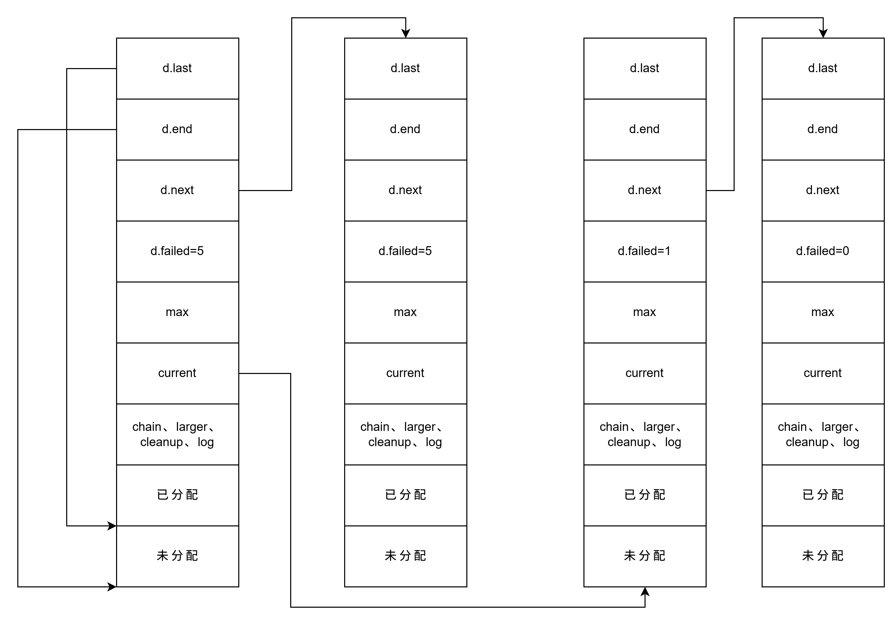

nginx 的内存池是一块连续的内存空间，当请求分配的内存过大无法分配时，将请求转发到系统分配器，并将返回的指针存储在内存池中，当内存池销毁时一并释放。

- `ngx_pool_cleanup_t`，清理程序。

  ```c
  typedef void (*ngx_pool_cleanup_pt)(void *data);

  struct ngx_pool_cleanup_s {
      ngx_pool_cleanup_pt handler;
      void *data;
      ngx_pool_cleanup_t *next;
  };
  ```

- `ngx_pool_large_t`，通过堆分配器分配的大内存块。

  ```c
  struct ngx_pool_large_s {
      ngx_pool_large_t *next;
      void *alloc;
  };
  ```

  - `alloc`，内存块起始地址。

- `ngx_pool_data_t`，内存池相关数据。

  ```c
  typedef struct {
      u_char *last;
      u_char *end;
      ngx_pool_t *next;
      ngx_uint_t failed;
  } ngx_pool_data_t;
  ```

  - `last`，空闲内存起始地址。

  - `end`，当前内存池结束地址。

  - `next`，下一个内存池。

  - `failed`，分配失败次数。

- `ngx_pool_t`，内存池。

  ```c
  struct ngx_pool_s {
      ngx_pool_data_t d;
      size_t max;
      ngx_pool_t *current;
      ngx_chain_t *chain;
      ngx_pool_large_t *large;
      ngx_pool_cleanup_t *cleanup;
      ngx_log_t *log;
  };
  ```

  - `max`，单个内存池最大大小。

  - `current`，当前正在使用的内存池。

  - `chain`，缓冲区链表，和内存池自身没什么关系，只是为了将内存管理的功能放在一起。



## 创建池

`ngx_pool_create(size, log)`，创建并返回内存池。

> 内存池对象自身也存储在分配的堆内存上，因此 `size` 需要大于 `NGX_MIN_POOL_SIZE`。

## 分配

- `ngx_palloc(pool, size)`，分配内存并返回。

  > 如果 `size <= pool->max`，则在内存池链表中找空闲内存进行分配。如果内存池链表中依然找不到空闲内存，则新建内存池，并让当前所有内存池的 `failed` 自增。
  >
  > 当 `faild` 大于某个数时（默认是 4），就让 `current` 后移一位，即无论内存池链表有多大，分配内存时都只会在链表的最后几个内存池中查找空闲内存（认为前面的内存池剩下的内存已经无法满足内存分配任务要求了）。
  >
  > 否则，直接通过 `ngx_alloc()` 分配内存，并插入到 `large` 链表中。

- `ngx_pool_cleanup_add(pool, size)`，分配 cleanup 内存，返回 `ngx_pool_cleanup_t*`。

## 释放

- `ngx_destroy_pool(pool)`，释放内存池。

  > 依次释放 cleanup、large 和 pool。

- `ngx_pfree(pool, p)`，释放 `large` 内存。
