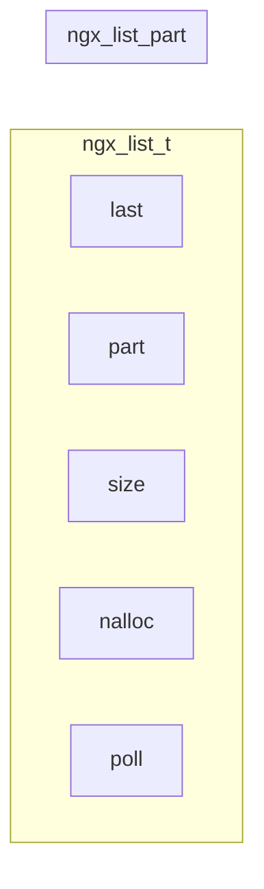

- [整数类型](#整数类型)
- [字符串](#字符串)
- [Array](#array)
  - [创建初始化](#创建初始化)
  - [添加元素](#添加元素)
- [List](#list)
  - [创建初始化](#创建初始化-1)

# 整数类型

nginx 代码通常只使用两种整数：`ngx_int_t` 和 `ngx_uint_t`，分别是 `intptr_t` 和 `uintptr_t` 的别名。

# 字符串

nginx 使用 `u_char*` 表示 C 字符串。nginx 的字符串类型定义如下：

```c
// src/core/ngx_string.h
typedef struct {
    size_t len;
    u_char *data;
} ngx_str_t;
```

字符串的长度由 `len` 定义，`data` 的末尾可能以空结尾，也可能以非空结尾。

# Array

```c
typedef struct {
    void *elts;
    ngx_uint_t nelts;
    size_t size;
    ngx_uint_t nalloc;
    ngx_pool_t *pool;
} ngx_array_t;
```

- `elts`，指向数组元素。

- `nelts`，数组当前元素数量。

- `size`，单个元素大小。

- `nalloc`，数组所有元素数量。

- `poll`，内存池。

## 创建初始化

- `ngx_array_create(poll, n, size)`，在内存池中创建空的数组对象，并初始化。

- `ngx_array_init(array, pool, n, size)`，使用内存池初始化已创建的数组对象。

- `ngx_array_destroy(array)`，释放数组。

## 添加元素

- `ngx_array_push(array)`，在数组末尾插入一个元素，并返回其指针。

- `ngx_array_push_n(array, n)`，在数组末尾插入 n 个元素，并返回第一个元素的指针。

当当前分配的容量不够添加元素时，如果数组分配在内存池的末尾，且内存池有多余的内存，则直接向后拓展一个元素的内存；否则，在内存池中分配两倍大小的内存块，并复制元素。

# List

```c
typedef struct ngx_list_part_s ngx_list_part_t;

struct ngx_list_part_s {
    void *elts;
    ngx_uint_t nelts;
    ngx_list_part_t *next;
};

typedef struct {
    ngx_list_part_t *last;
    ngx_list_part_t part;
    size_t size;
    ngx_uint_t nalloc;
    ngx_pool_t *pool;
} ngx_list_t;
```

`ngx_list_t` 将内存组织成块（nginx 中称为 part），然后将这些块通过链表串起来。

- `elts`，块起始地址。

- `nelts`，块有效元素数量。

- `part`，链表头节点。

- `tail`，链表尾节点。

- `size`，块中每个元素大小。

- `nalloc`，块中元素数量。




## 创建初始化

```c
void iter_list(ngx_list_t *list) {
    printf("list.size = %lu, list.nalloc = %lu\n", list->size, list->nalloc);

    ngx_uint_t i = 0;
    ngx_list_part_t *part = &list->part;
    while (part != NULL) {
        ngx_int_t *data = part->elts;
        for (ngx_uint_t j = 0; j < part->nelts; ++j) {
            printf("chunk[%lu] [%lu] = %ld\n", i, j, data[j]);
        }
        part = part->next;
        ++i;
    }
}

void test_list(ngx_log_t *log) {
    ngx_pool_t *pool = ngx_create_pool(1024, log);

    ngx_list_t *list = ngx_list_create(pool, 2, sizeof(ngx_int_t));
    *((ngx_int_t *)ngx_list_push(list)) = 1;
    *((ngx_int_t *)ngx_list_push(list)) = 2;
    *((ngx_int_t *)ngx_list_push(list)) = 3;
    *((ngx_int_t *)ngx_list_push(list)) = 4;
    *((ngx_int_t *)ngx_list_push(list)) = 5;

    iter_list(list);
}
```

```shell
list.size = 8, list.nalloc = 2
chunk[0] [0] = 1
chunk[0] [1] = 2
chunk[1] [0] = 3
chunk[1] [1] = 4
chunk[2] [0] = 5
```
