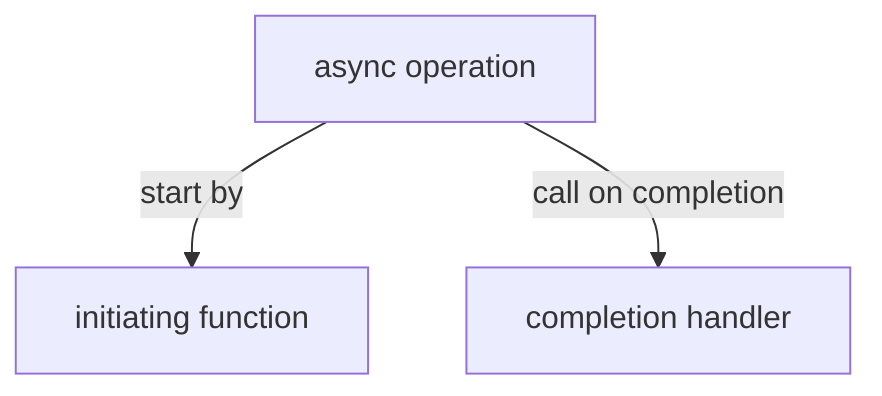
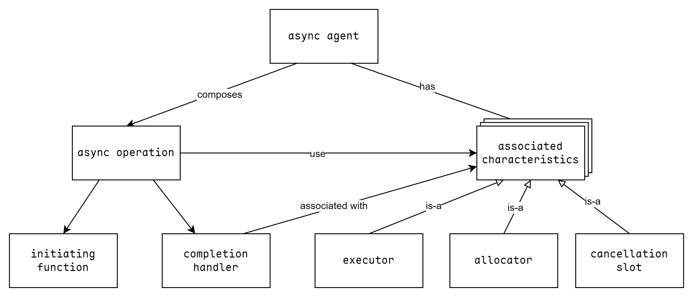

# async operation



异步操作通过 initiaing function 启动，异步结束后调用 completion handler。

- 当 async operation 是泛型时，completion handler 的参数类型和顺序由 initiating function 决定。

- 调用 completion handler 之前，会释放异步操作所有需要的临时资源。

  > 该特性允许在 completion handler 中进行异步操作链，而无需担心无效资源占用。

# async agent

async agent 是异步操作的顺序组合，每个异步操作都视为 async agent 的一部分运行，async agent 中的异步操作是同步进行的。

> async agent 只是一个概念模型，asio 中并不存在实际的 async agent。



# associated characteristics

- executor，决定 completion handler 如何排队并执行。

- allocator，异步操作的资源分配。

- cancellation slot，决定异步操作如何支持取消操作。

# completion token


asio 通过 completion token 支持异步操作的多重组合机制，按照惯例，token 是异步函数的最后一个参数。

- 如果传递函数对象，则操作行为等价于回调函数。

- 如果传递 `use_future`，则异步函数立刻返回 `std::future` 对象，用于等待结果。

- 如果传递 `use_awaitable`，则返回基于 c++标准的 awaitable，用于 `co_await`。

所有的用法都通过单一的 initiating function 实现。

completion token 作为 completion handler 的原型，如果 token 为函数对象，则 token 已经满足 handler 的要求。

## async_initiate

asio 通过 `async_initiate()` 处理不同的 token，主要有两类：

第一类，满足以下条件：

- Signatures 都是函数类型。

  > 为什么使用可变参数？

- `async_result<decay_t<CompletionToken>, Signatures...>::initiate` 良构。

```cpp
template<
    typename CompletionToken,
    ASIO_COMPLETION_SIGNATURE... Signatures,
    typename Initiation,
    typename... Args>
inline auto async_initiate(Initiation &&initiation,
                           type_identity_t<CompletionToken> &token,
                           Args &&...args)
    -> decltype(/*...*/) {
  return async_result<decay_t<CompletionToken>, Signatures...>::initiate(
      static_cast<Initiation &&>(initiation),
      static_cast<CompletionToken &&>(token),
      static_cast<Args &&>(args)...);
}
```

第二类，不满足第一类情况，但满足：

- `async_result<decay_t<CompletionToken>, Signatures...>>::return_type` 良构。

```cpp
template <typename CompletionToken, ASIO_COMPLETION_SIGNATURE... Signatures,
          typename Initiation, typename... Args>
inline /**/
async_initiate(Initiation &&initiation, type_identity_t<CompletionToken> &token,
               Args &&...args) {
  async_completion<CompletionToken, Signatures...> completion(token);

  static_cast<Initiation &&>(initiation)(
      static_cast<typename async_result<
          decay_t<CompletionToken>, Signatures...>::completion_handler_type &&>(
          completion.completion_handler),
      static_cast<Args &&>(args)...);

  return completion.result.get();
}
```

# 实现一个 timeout token

```cpp
#include <asio.hpp>
#include <asio/experimental/parallel_group.hpp>
#include <print>

using tcp = asio::ip::tcp;

template <typename InnerToken>
struct timeout_token_t {
    InnerToken token;
    std::chrono::milliseconds timeout;
};

template <typename InnerToken>
auto timeout_token(InnerToken token, uint64_t msec) -> timeout_token_t<InnerToken> {
    return {token, std::chrono::milliseconds{msec}};
}

template <typename... Signatures>
struct initiate_timeout {

    template <typename InnerToken, typename Initiation, typename... Args>
    auto operator()(InnerToken token, std::chrono::milliseconds timeout, Initiation &&initiation, Args &&...args) -> void {
        auto ex = asio::get_associated_executor(token, asio::get_associated_executor(initiation));
        auto alloc = asio::get_associated_allocator(token);
        auto timer = std::allocate_shared<asio::steady_timer>(alloc, ex, timeout);
        asio::experimental::make_parallel_group(
            asio::bind_executor(ex, [&](auto &&token) {
                return timer->async_wait(std::forward<decltype(token)>(token));
            }),
            asio::bind_executor(ex, [&](auto &&token) {
                return asio::async_initiate<decltype(token), Signatures...>(std::forward<Initiation>(initiation), token,
                                                                            std::forward<Args>(args)...);
            }))
            .async_wait(asio::experimental::wait_for_one(), [token = std::move(token), timer](std::array<std::size_t, 2>, std::error_code ec, auto... underlying_op_results) mutable {
                timer.reset();
                std::move(token)(std::move(underlying_op_results)...);
            });
    }
};

template <typename InnerToken, typename... Signatures>
struct asio::async_result<timeout_token_t<InnerToken>, Signatures...> {

    template <typename Initiation, typename... Args>
    static auto initiate(Initiation &&init, timeout_token_t<InnerToken> tt, Args &&...args) {
        return asio::async_initiate<InnerToken, Signatures...>(
            initiate_timeout<Signatures...>{},
            tt.token,
            tt.timeout,
            std::forward<Initiation>(init),
            std::forward<Args>(args)...);
    }
};

auto do_read(tcp::socket sock) -> asio::awaitable<void> {
    char buf[1024];
    while (true) {
        n = co_await sock.async_read_some(asio::mutable_buffer{buf, 1024}, timeout_token(asio::asio::use_awaitable, 2000));
        if (n == 0) {
            std::println("timeout");
            sock.close();
            co_return;
        }
        buf[n] = 0;
        std::println("recv {}", buf);
    }
}

auto do_accept() -> asio::awaitable<void> {
    auto ex = co_await asio::this_coro::executor;
    auto acceptor = tcp::acceptor{ex, tcp::endpoint{tcp::v4(), 8888}};
    while (true) {
        auto sock = co_await acceptor.async_accept(asio::use_awaitable);
        asio::co_spawn(ex, do_read(std::move(sock)), asio::detached);
        std::println("new connection");
    }
}

auto main() -> int {
    auto io = asio::io_context{};
    asio::co_spawn(io, do_accept(), asio::detached);
    io.run();
    return 0;
}
```
