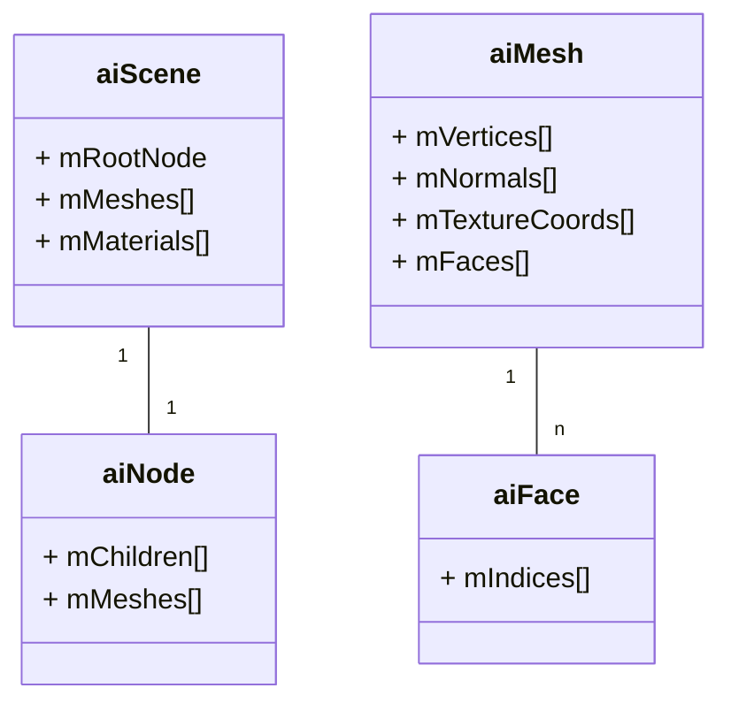

assimp（open asset import library） 是一个通用模型导入库，可以将不同类型的模型文件导入为 assimp 通用数据类型。

导入文件的数据通过 `aiScene` 存放。

> `aiScene` 除了存储基本的网格、材质信息，还存储动画、相机、光照等信息。
>
> `aiMesh` 除了存储基本的顶点、法向量、贴图坐标等信息，还存储 uv 贴图、骨骼绑定、绑定盒等信息。

mesh 表示一个完整的模型，face 是渲染 mesh 的图元。
