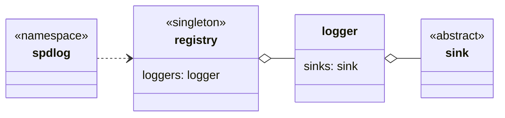

---

`spdlog` 中定义了一些自由函数，通过这些函数可以直接操作默认 logger。

---

`registry` 是 spdlog 的全局管理器，将 logger 注册到 registry 中，管理所有 logger 的属性。且 registry 内置一个默认的 logger。

---

`logger` 是 sink 的管理器，将 sink 绑定到 logger 上，通过 logger 统一调用日志写入。

`logger` 是同步的方式进行日志记录的，可以使用 `async_logger` 进行异步日志记录。

---

`sink` 是执行日志消息写入的对象，spdlog 预定义了多种 sink，常用的有：

- `basic_file_sink`，普通输出到文件的 sink。

- `daily_file_sink`、`hourly_file_sink`、`rotating_file_sink`，自动归档日志文件的 sink。

- `dist_sink`，包装其它 sink 的 sink。

- `dup_filter_sink`，屏蔽连续重复消息的 sink。

  ```cpp
  auto main() -> int {
    // 最多屏蔽4s内的连续相同消息
    auto dup_sink = std::make_shared<spdlog::sinks::dup_filter_sink_mt>(std::chrono::seconds{4});
    dup_sink->add_sink(std::make_shared<spdlog::sinks::stdout_color_sink_mt>());
    spdlog::default_logger_raw()->sinks()[0] = dup_sink;

    for (auto i = 0; i < 5; ++i) {
      spdlog::info("info");
      std::this_thread::sleep_for(std::chrono::seconds{1});
    }
    return 0;
  }
  ```

  ```shell
  [2025-03-05 11:50:27.932] [info] info
  [2025-03-05 11:50:31.933] [info] Skipped 3 duplicate messages..
  [2025-03-05 11:50:31.933] [info] info
  ```

- `kafka_sink`、日志到 apache kafka。

- `mongo_sink`，日志到 mongo 数据库。

- `null_sink`，什么都不做的 sink。

- `ostream_sink`，基于 std::ostream 的 sink。

- `qt_color_sink`，基于 `QTextEdit` 的 sink。

- `stdout_color_sink_mt`，带颜色输出到 stdout 的 sink。

- `ringbuffer_sink`，输出到内部循环队列的 sink，后续可以从队列中获取日志信息。

- `syslog_sink`，基于 `syslog` 的 sink。

- `tcp_sink`、`udp_sink`，基于网络的 sink。
