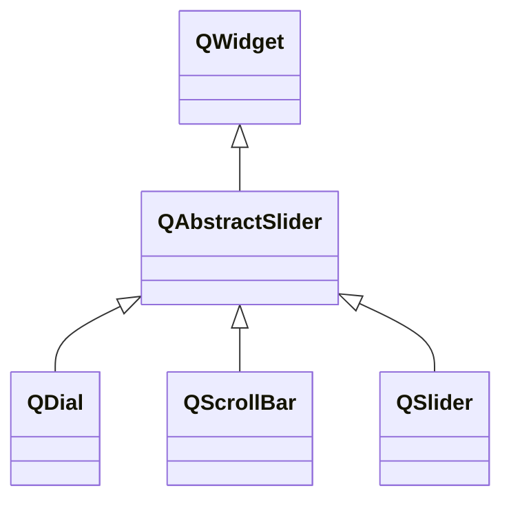

---

#### QAbstractSlider

Slider是可滑动的小部件。

###### 常用属性

| 属性                 | 类型              | 说明                                                         |
| -------------------- | ----------------- | ------------------------------------------------------------ |
| maximum minimum | `int`             | 最大/最小值。                                                |
| value                | `int`             | 当前值。                                                     |
| sliderPosition       | `int`             | 当前位置。                                                   |
| singleStep           | `int`             | 每次移动的步长。                                             |
| pageStep             | `int`             | 每次翻页的步长。                                             |
| orientation          | `Qt::Orientation` | 滑块的方向，默认`Qt::Vertical`。                             |
| sliderDown           | `bool`            | 滑块是否被按下。                                             |
| tracking             | `bool`            | 是否允许追踪，默认`true`。如果允许追踪，sliderPosition永远等于value。 |

###### 常用函数

| 函数原型                                                   | 说明                                       |
| ---------------------------------------------------------- | ------------------------------------------ |
| `void triggerAction(QAbstractSlider::SliderAction action)` | 触发一个滑块的动作，如移动一步或移动一页。 |

###### 常用信号

| 信号原型                       | 说明                 |
| ------------------------------ | -------------------- |
| `void sliderMoved(int value)`  | 拖动位置变化时触发。 |
| `void valueChanged(int value)` | 滑块值变化时触发。   |
| `void sliderPressed()`         | 滑块按下时触发。     |
| `void sliderReleased()`        | 滑块释放时触发。     |
